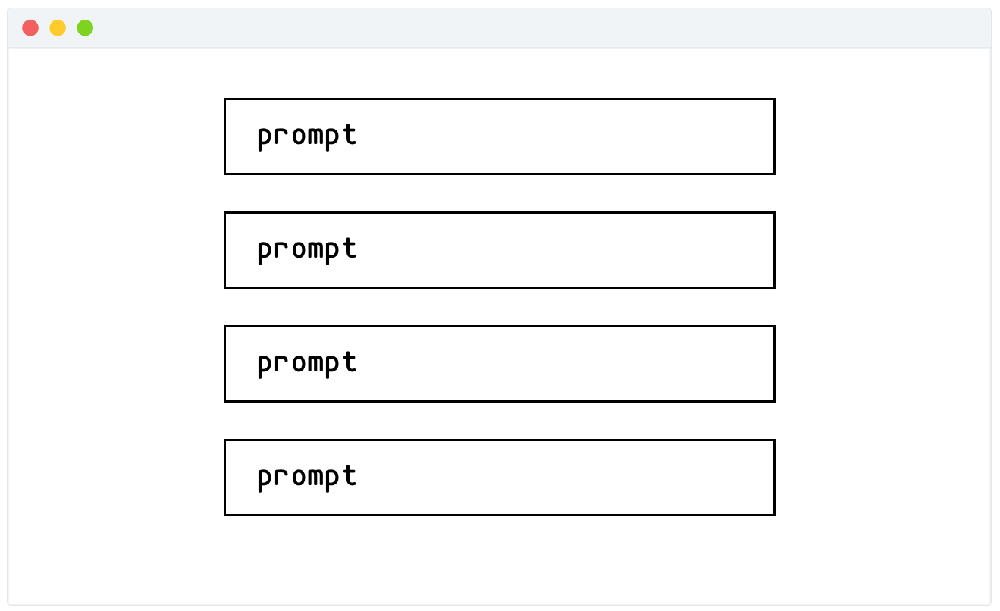
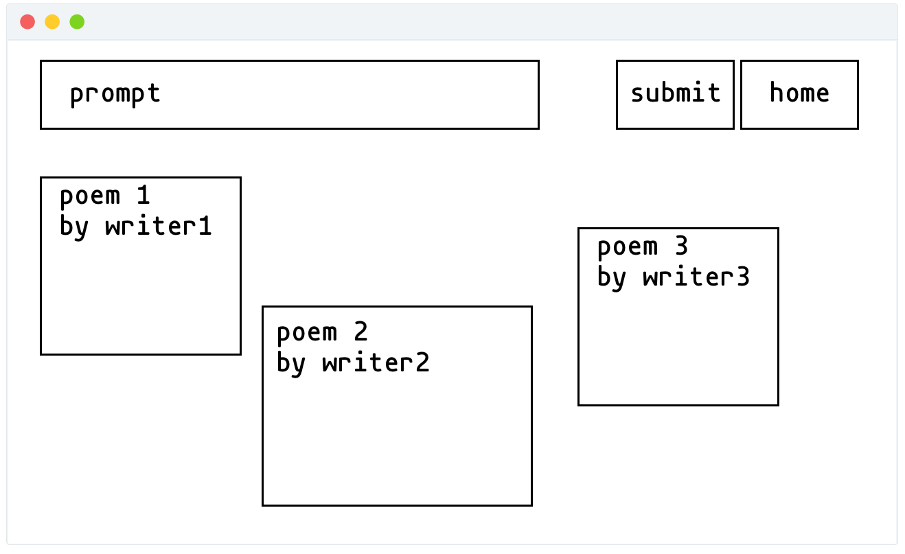

# 🌸 wallflower 🌼

## Overview

Wallflower is a web app that will allow users to view and post poems based on a given prompt. Users can register and login. Once they're logged in, they can create a poem or view what others have written.


## Data Model

I'll be storing `Prompts`, `Users` and `Poems`.

* each `Prompt` can have multiple `Poems` (via references)
* each `User` can have multiple `Poems` (via references)

an example `Prompt`:
```javascript
{
    title: 'write a poem with 3 rhymes',
    poems: //an array of references to Poem documents
}
```

an example `User`:

```javascript
{
    name: 'jane doe',
    userID:  //generated UUID
    poems: //an array of references to Poem documents
}
```

an example `Poem`:
```javascript
{
  user: // a reference to a User object
  prompt: //a reference to a Prompt object
  body: "this is a poem.",
  likes: 4
}
```

## First Draft Schema
[Link to Schema](wallflower/db.js)


## Wireframes

Homepage (after logging in)


Page for a specific `Prompt`


Page for a specific `User`


## Site map


## User stories

1. as a `User`, I can create a new poem based on a given prompt
2. as a `User`, I can view all of the poems that respond to a given prompt
3. as a `User`, I can move the poems on a prompt page to display it the way I like
4. as a `User`, I can like a poem (tentative)

## Research Topics
* (3 points) Client-side JavaScript library
    * [Quill.js](https://quilljs.com/) as the text editor for users to submit poems
    * [Interact.js](http://interactjs.io/) to allow poems to be draggable (tentative...)    
* (2 points) CSS Framework
    * [Tachyons](http://tachyons.io/)
* (6 points) Integrate user authentication
    * I'm going to be using passport for user authentication
    * I'll make an account for testing and email you the password
* (3 points) Unit testing with JavaScript
    * Mocha
    * Chai (Assert)
* ... for total of 14 points (more than required)
    * additional points will not count for extra credit


## Project Requirements
* (15 points) minimum 3 x forms or ajax interactions (excluding login)
* (6 points) minimum 3 x any of the following (can be the same):
    * use `filter` to filter poems with most comments
    * use `filter` to filter poems with most likes
    * use `filter` to filter users with most poems
* (2 points) minimum 2 x mongoose schemas
* (9 points) stability / security
    * simple validation on user input to prevent application from crashing
    * doesn't allow user input to be displayed unescaped directly on page
    * pages that require authentication cannot be accessed without authentication
* (5 points) originality
    * is not mostly based on existing homework
    majority of code is not from online tutorial
